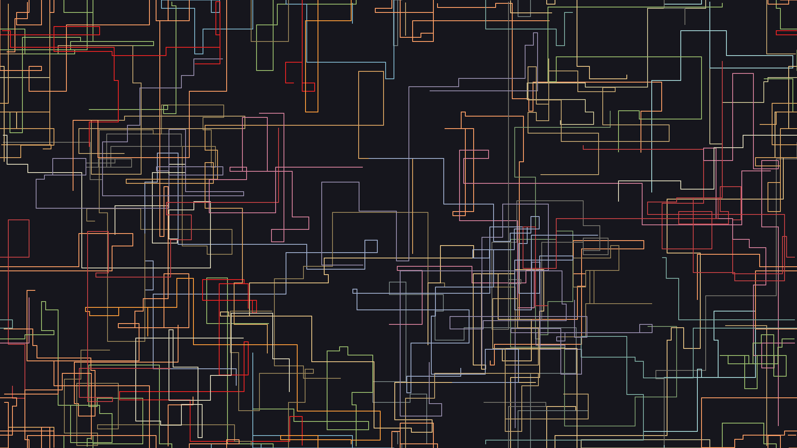
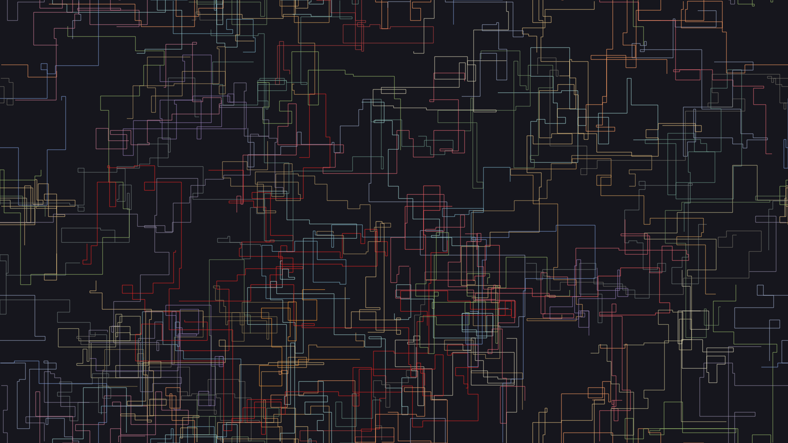

# pipes.web

The famous terminal screensaver, in the browser.





## Installation

`npm install`

## Usage

- Start development server: `npm run dev`
- Create production build: `npm run build`
- Serve production build: `npm run preview`

The behavior can be altered by passing the following URL parameters:

- `count`: The number of pipes shown at the same time (default: 12)
- `increment-length`: The length of the line (in pixels) added to each pipe during a refresh (default: 10)
- `lifespan`: The number of refresh cycles a pipe goes through before a new one is generated (default: 250)
- `refresh-period`: The period of a refresh cycle (in milliseconds) (default: 50)
- `width`: The thickness of the lines (in pixels) (default: 2)

```
?count=12&increment-length=10&lifespan=250&refresh-period=50&width=2
```

## Built with

[Vite](https://github.com/vitejs/vite/) and [TypeScript](https://github.com/microsoft/TypeScript/)

## Author

- **Pierre-Alain Castella** - _Initial work_ - [metapho-re](https://github.com/metapho-re)

## License

This project is licensed under the MIT License - see the [LICENSE](LICENSE) file for details.
